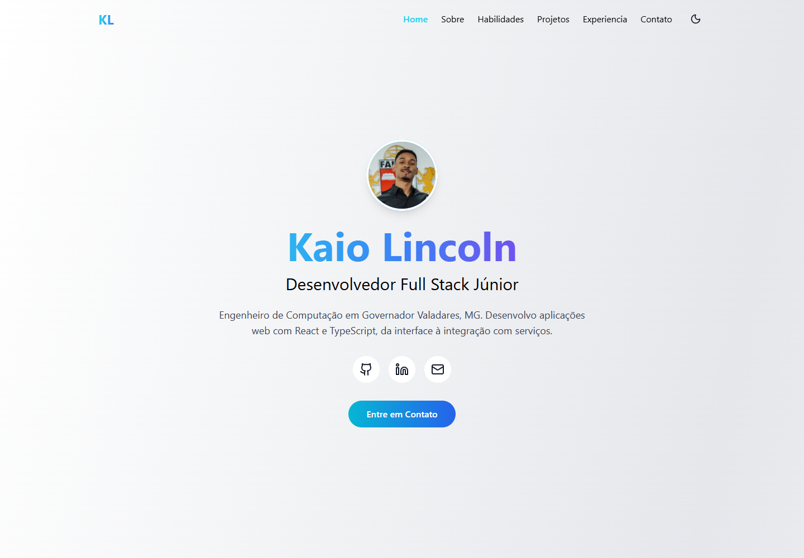

# Portfólio — Kaio Lincoln

Portfólio de desenvolvedor full stack em Governador Valadares, MG, com projetos, estudos de caso, habilidades, experiência e contato.

[Acessar portfólio](https://kaiolincoln.github.io/Portifolio-kaio-/)



## Stack e funcionalidades

React 19, JavaScript/JSX, Vite 7, Tailwind CSS 3 e Lucide React. EmailJS é carregado apenas ao enviar o formulário configurado. Não há backend próprio neste repositório.

- Tema claro/escuro persistido localmente.
- Navegação por seções, menu mobile e link para pular ao conteúdo.
- Filtros de tecnologias, carrosséis e detalhes acessíveis por teclado.
- Modal nativo com foco inicial, ciclo Tab/Shift+Tab, Escape e retorno ao botão de origem.
- Imagens de projetos com carregamento adiado e foto WebP de 3,62 KB (128 px) e 8,46 KB (256 px), geradas da nova foto de formatura.
- Metadados em português, favicon próprio, URL canônica e imagem Open Graph.

## Executar localmente

Requisitos: Node.js 22.12+ e npm. Chrome é necessário para os testes e Lighthouse.

```bash
git clone https://github.com/kaiolincoln/Portifolio-kaio-.git
cd Portifolio-kaio-
npm ci
npm run dev
```

Abra o endereço informado pelo Vite, com o caminho `/Portifolio-kaio-/`.

```bash
npm run lint
npm run build
npm run preview
npm test
```

Os testes Playwright cobrem navegação, filtros, carrossel, foco do modal, persistência do tema, menu mobile e validação/sucesso/erro do formulário. As requisições de e-mail são interceptadas; nenhum e-mail real é enviado. Os identificadores usados pelo servidor de teste são fictícios e não habilitam o envio em produção.

O workflow em `.github/workflows/ci.yml` executa lint, build e testes em Ubuntu, incluindo a resolução de imports com distinção entre maiúsculas e minúsculas. Sua execução remota depende do push; as verificações desta alteração foram executadas localmente no Windows.

## Configurar contato

Copie `.env.example` para `.env.local` e preencha os três identificadores públicos da sua conta:

```dotenv
VITE_EMAILJS_SERVICE_ID=
VITE_EMAILJS_TEMPLATE_ID=
VITE_EMAILJS_PUBLIC_KEY=
```

No template EmailJS, configure `from_name`, `from_email`, `message` e `reply_to`, com o destinatário correto. Os valores `VITE_*` são incluídos no frontend; não use senha ou chave privada. Veja a [documentação oficial de envio](https://www.emailjs.com/docs/sdk/send/).

Reinicie o servidor ou gere um novo build após preencher as variáveis. Sem configuração, a seção oferece contato direto por e-mail e redes sociais, sem um formulário que promete envio. A entrega real ainda depende da configuração da conta e de um teste autorizado.

## Projetos e conteúdo

`src/data/projects.js` é a fonte única para título, slug, imagens, stack, descrições, desafios, destaque, estudo de caso e `demoUrl` de cada projeto. Use `Tailwind CSS` como nome padronizado.

- [Estudo de caso: GymFlow](docs/projects/gymflow/README.md)
- [Estudo de caso: SaaS para Barbearia](docs/projects/barbearia/README.md)

Esses documentos incluem fontes técnicas e limites de verificação. Foram adicionados neste portfólio; os READMEs dos repositórios externos não foram alterados.

Os oito projetos ainda têm `demoUrl: null`: os repositórios consultados não forneceram uma demo pública confirmada. Preencha apenas com endereços acessíveis e verificados; os botões de demo aparecem automaticamente no card e no modal. Não existem métricas de adoção inventadas.

## Lighthouse

Auditoria mobile do build de produção servido localmente, em 06/09/2026: **Performance 98, Acessibilidade 100, Boas práticas 100, SEO 100**.

[Relatório HTML](docs/audits/lighthouse.html) · [Dados JSON](docs/audits/lighthouse.json)

A medição usa Chrome headless e a simulação padrão mobile do Lighthouse 12.8.2. Os resultados variam conforme máquina, rede e configuração. Não representam uma medição do deploy público nem uma certificação de acessibilidade de todos os estados da interface. A auditoria foi feita com o contato alternativo por e-mail, sem credenciais EmailJS.

Persistem oportunidades pequenas: CSS necessário à primeira renderização, parte do runtime React não utilizada na primeira dobra e seleção de tamanho responsivo da foto. O aviso de back/forward cache decorre das flags do navegador da auditoria.

Para reproduzir, com `npm run preview` ativo na porta 4173:

```bash
npm run audit
npm run screenshot
```

Para gerar novamente a foto WebP: `node scripts/optimize-profile.mjs`.

## Publicação

`homepage`, `base` do Vite e metadados usam `https://kaiolincoln.github.io/Portifolio-kaio-/`, endereço que respondeu HTTP 200 durante a revisão.

```bash
npm run deploy
```

O script gera o build e publica `dist` na branch `gh-pages`. Configure o GitHub Pages para servir essa branch. O envio ao GitHub não é executado pelos testes ou pela auditoria. Se mudar o nome do repositório ou usar domínio próprio, atualize os endereços em `package.json`, `vite.config.js` e `index.html`.
